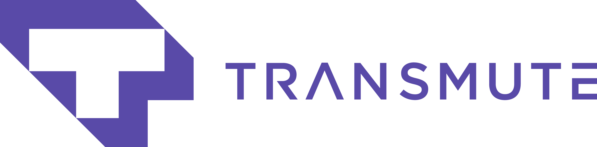

---
> Launchpad is a shell script to set up a macOS laptop for design and development.

It can be run multiple times on the same machine safely. It installs, upgrades, or skips packages based on what is already installed on the machine.

## Install

Download the script:

```sh
git clone git@github.com/tansmute-industries/launchpad.git && cd launchpad
```

Review the script (please don't run scripts you don't understand):

```sh
less launchpad
```

launchpad:

```sh
cd launchpad
./launchpad 2>&1 | tee ~/launchpad.log
```
Just follow the prompts and you’ll be fine. 👌

⚠️ Warning ⚠️: I advise against running [this script](launchpad) unless you understand what it’s doing to your computer.

I created this based on my own preferences; your mileage may vary.

Once the script is done, quit and relaunch Terminal.

It is highly recommended to run the script regularly to keep your computer up to date.

Your last launchpad run will be saved to `~/launchpad.log`. To review it, run `less ~/launchpad.log`.

That's it! :sparkles:


## What it sets up
The setup process will install:

<details>
<summary>Basic tools:</summary>

* [XCode Command Line Tools](https://developer.apple.com/xcode/downloads/) for developer essentials.
* [Git](https://git-scm.com/) for version control
* [Homebrew](http://brew.sh/) for managing operating system libraries.
</details>

<details>
<summary>Package Managers:</summary>

* [NVM](https://github.com/creationix/nvm/) for managing and installing multiple versions of [Node.js](http://nodejs.org/) and [npm](https://www.npmjs.org/)
</details>

<details>
<summary>CLI Tools & Utilities:</summary>

* [mas](https://github.com/mas-cli/mas) Mac App Store command line interface
</details>

### Apps


<details>
<summary>Development</summary>
* [Visual Studio Code](https://code.visualstudio.com/) IDE
</details>

<details>
<summary>Design</summary>

* [Figma](https://www.figma.com/) for design.
</details>

<details>
<summary>Communication</summary>

* [Slack](https://slack.com/) where work happens.
</details>


<details>
<summary>Browsers</summary>

* [Brave](https://brave.com/) for web browsing without ads.
* [Chrome](https://www.google.com/chrome/browser/desktop/) for fast and free web browsing.
* [Firefox](https://www.mozilla.org/en-US/firefox/new/) for web browsing and testing.
</details>

<sub>See [`sources`](sources) for the full list of apps that will be installed. Adjust it to your personal taste.</sub>

It should take less than 20 minutes to install (depends on your machine).

## Known Issues
Cask does not recognize applications installed outside of Homebrew Cask – in the case that the script fails, you can either remove the application from the install list or uninstall the application causing the failure and try again.

## Acknowledgements

Inspiration and code was taken from many sources, including:

* [Mina Markham's](https://github.com/mathiasbynens) [formation](https://github.com/minamarkham/formation)
> NOTE: Launchpad is fork of [formation](https://github.com/minamarkham/formation)

* [Mathias Bynens'](https://github.com/mathiasbynens) [dotfiles](https://github.com/mathiasbynens/dotfiles)
* thoughtbot's [laptop](https://github.com/thoughtbot/laptop/)

## 📜  License

launchpad is customized for my own needs. It is free software, and may be redistributed under the terms specified in the [LICENSE] file.

[LICENSE]: LICENSE
